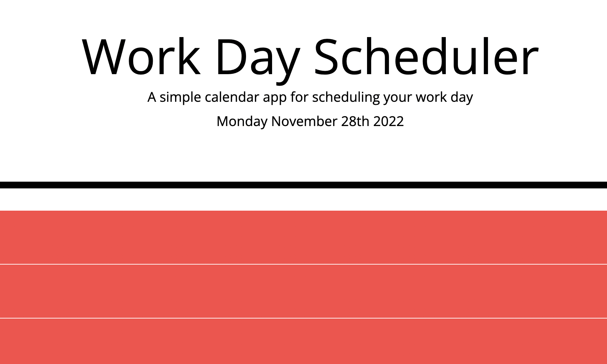

# Work Day Planner

## Usage

Simple application provides a timeblock for each hour between 8am-6pm,

each time block has a text area to input information and a save button that saves input text to local storage.

Each time block is color coded as past (red), present (blue), and future(green)

[Link to Deployed site]()
